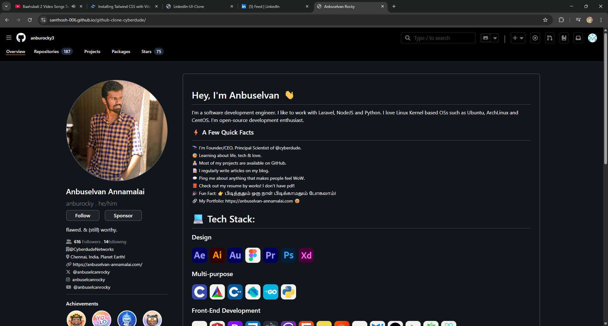

# GitHub Clone 🌐

A responsive **GitHub UI Clone** built using **HTML** and **Tailwind CSS**.  
This project focuses on recreating the GitHub homepage layout while practicing modern UI design and utility-first CSS.

---

## 🚀 Live Demo

🔗 **Live Link:**  
[Click here to view the project](https://santhosh-006.github.io/github-clone-cyberdude/)

---

## 📸 Output Preview

---

## 🛠️ Built With

- **HTML5**
- **Tailwind CSS**
- **Responsive Design**
- **Flexbox & Grid**

---

## ✨ Features

- GitHub-style navigation bar
- Responsive layout for all screen sizes
- Clean and modern UI
- Tailwind utility-based styling
- Pixel-inspired GitHub design

---
